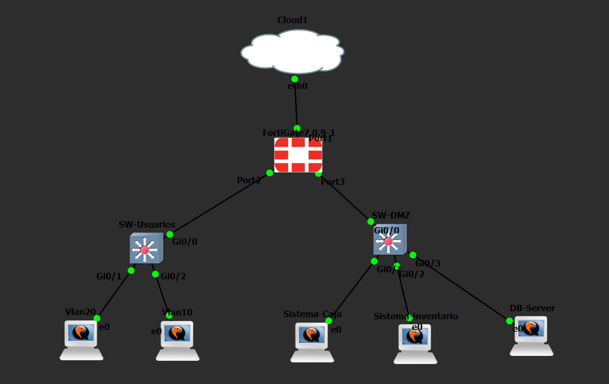

# FortiGate DMZ VLAN Lab

Laboratorio de seguridad de red desarrollado en **GNS3** utilizando **FortiGate 7.0.9**, **2 switches Cisco IOSvL2**, dos estaciones Windows y tres servidores Ubuntu dentro de una DMZ.

El objetivo principal es implementar segmentación mediante VLAN, control de acceso entre redes, protección de una DMZ, filtrado web, acceso SSH restringido y salida a Internet limitada para los servidores.

## Video de demostración

> Pendiente: agregar aquí el enlace del video de demostración del laboratorio.

---

## Topología

### Topología real en GNS3



### Diagrama de la topología


La topología está compuesta por:

- **Cloud1 / Internet** conectado al **port1** del FortiGate.
- **FortiGate 7.0.9-1** como firewall y gateway de las redes.
- **SW-USUARIOS**, conectado al **port2** del FortiGate mediante trunk 802.1Q.
- **VLAN 10** para usuarios.
- **VLAN 20** para administración.
- **SW-DMZ**, conectado físicamente al **port3** del FortiGate.
- **VLAN 30** en SW-DMZ como segmentación de capa 2 para los servidores.
- Tres servidores Ubuntu dentro de la red DMZ:
  - Sistema de Caja.
  - Sistema de Inventario.
  - DB-Server.

### Relación física principal

```text
Cloud1
  |
FortiGate port1
  |
  +-- port2 --> SW-USUARIOS Gi0/0
  |              |-- Gi0/1 --> VLAN20 --> Windows 10.21.40.140/25
  |              `-- Gi0/2 --> VLAN10 --> Windows 10.21.40.10/25
  |
  `-- port3 --> SW-DMZ Gi0/0
                 |-- Gi0/1 --> Sistema-Caja        10.21.41.2/28
                 |-- Gi0/2 --> Sistema-Inventario  10.21.41.3/28
                 `-- Gi0/3 --> DB-Server           10.21.41.4/28
```

---

## Direccionamiento IP

| Segmento / Dispositivo | Dirección IP | Máscara | Gateway |
|---|---|---|---|
| **VLAN 10 – Usuarios** | `10.21.40.0/25` | `255.255.255.128` | `10.21.40.1` |
| FortiGate VLAN10 | `10.21.40.1/25` | `255.255.255.128` | — |
| Windows VLAN10 | `10.21.40.10/25` | `255.255.255.128` | `10.21.40.1` |
| **VLAN 20 – Administración** | `10.21.40.128/25` | `255.255.255.128` | `10.21.40.129` |
| FortiGate VLAN20 | `10.21.40.129/25` | `255.255.255.128` | — |
| Windows VLAN20 | `10.21.40.140/25` | `255.255.255.128` | `10.21.40.129` |
| **DMZ – Servidores** | `10.21.41.0/28` | `255.255.255.240` | `10.21.41.1` |
| FortiGate DMZ-SW | `10.21.41.1/28` | `255.255.255.240` | — |
| Sistema de Caja | `10.21.41.2/28` | `255.255.255.240` | `10.21.41.1` |
| Sistema de Inventario | `10.21.41.3/28` | `255.255.255.240` | `10.21.41.1` |
| DB-Server | `10.21.41.4/28` | `255.255.255.240` | `10.21.41.1` |
| **WAN / port1** | DHCP desde Cloud1 | Dinámica | Gateway dinámico |

La documentación completa se encuentra en:

[Direccionamiento/Direccionamiento-IP.md](Direccionamiento/Direccionamiento-IP.md)

---

## Configuración del FortiGate

Toda la configuración y demostración del FortiGate se realizó mediante **GUI**, conforme al requerimiento de la práctica.

### Interfaces principales

- **port1**: WAN, configurado mediante DHCP desde Cloud1.
- **port2**: enlace físico hacia SW-USUARIOS.
- **VLAN10** sobre port2:
  - VLAN ID: `10`
  - Gateway: `10.21.40.1/25`
- **VLAN20** sobre port2:
  - VLAN ID: `20`
  - Gateway: `10.21.40.129/25`
- **DMZ-SW**:
  - Gateway: `10.21.41.1/28`
  - Miembros configurados: `port3`, `port4`, `port5`
  - En la topología actual, **port3** es el enlace físico utilizado hacia **SW-DMZ**.
  - `port4` y `port5` no tienen conexión física.

### Servidores DMZ

| Puerto SW-DMZ | Servidor | IP | Servicio principal |
|---|---|---|---|
| Gi0/1 | Sistema de Caja | `10.21.41.2/28` | Nginx + SSH |
| Gi0/2 | Sistema de Inventario | `10.21.41.3/28` | Nginx + SSH |
| Gi0/3 | DB-Server | `10.21.41.4/28` | MariaDB + SSH |

### Políticas de seguridad implementadas

- **VLAN20_to_DMZ_SSH**: permite SSH desde VLAN 20 hacia la DMZ.
- **VLAN10_to_CAJA_WEB**: permite HTTP/HTTPS desde VLAN 10 hacia el Sistema de Caja.
- **VLAN10_INVENTARIO_WEBFILTER**: aplica Web Filter al acceso desde VLAN 10 hacia Inventario.
- **BLOQUEO_VLAN10_INVENTARIO**: política de denegación de respaldo para Inventario.
- **DENY_VLAN10_SSH_DMZ**: bloquea SSH desde VLAN 10 hacia la DMZ.
- **DMZ_to_DNS**: permite únicamente consultas DNS hacia destinos autorizados.
- **DMZ_to_Ubuntu_Updates**: permite HTTP/HTTPS hacia endpoints autorizados de actualización de Ubuntu.
- **DENY_DMZ_TO_INTERNET**: bloquea el resto del acceso a Internet desde la DMZ.
- **DENY_DMZ_TO_VLAN10**: impide tráfico iniciado desde la DMZ hacia VLAN 10.
- **DENY_DMZ_TO_VLAN20**: impide tráfico iniciado desde la DMZ hacia VLAN 20.

### Web Filter

Se configuró el perfil:

`WF_BLOQUEO_INVENTARIO`

para bloquear el acceso al servidor de Inventario:

`10.21.41.3`

cuando el tráfico se origina desde VLAN 10. La evidencia muestra de forma visible la página de bloqueo de FortiGuard.

La documentación gráfica del FortiGate está disponible en:

[Configuración FortiGate.pdf](Configuracion%20fortigate/Configuracion%20FortiGate.pdf)

---

## Configuración de los switches Cisco

Se utilizan **2 switches Cisco IOSvL2** para cumplir con la segmentación y la seguridad básica de red solicitadas.

### SW-USUARIOS

SW-USUARIOS conecta las estaciones Windows de VLAN 10 y VLAN 20 con el FortiGate.

| Interfaz | Configuración | Destino |
|---|---|---|
| Gi0/0 | Trunk 802.1Q, VLAN 10 y 20 | FortiGate port2 |
| Gi0/1 | Access VLAN 20 | Windows VLAN20 |
| Gi0/2 | Access VLAN 10 | Windows VLAN10 |

VLAN configuradas:

- **VLAN 10 – USUARIOS**
- **VLAN 20 – ADMIN**

Medidas de seguridad:

- Port Security.
- Sticky MAC.
- Máximo de una MAC por puerto de acceso.
- Violación en modo `restrict`.
- PortFast.
- BPDU Guard.
- SSH versión 2.

[Running-config de SW-USUARIOS](Show%20running-config/Show%20running-config%20Switch-usuarios.txt)

### SW-DMZ

SW-DMZ concentra los tres servidores y los conecta con el FortiGate a través de port3.

| Interfaz | Configuración | Destino |
|---|---|---|
| Gi0/0 | Access VLAN 30 | FortiGate port3 |
| Gi0/1 | Access VLAN 30 | Sistema de Caja |
| Gi0/2 | Access VLAN 30 | Sistema de Inventario |
| Gi0/3 | Access VLAN 30 | DB-Server |

La **VLAN 30 – DMZ** se utiliza únicamente como segmentación de capa 2 en el switch. La red IP de los servidores continúa siendo `10.21.41.0/28`.

Medidas de seguridad:

- Port Security en Gi0/1, Gi0/2 y Gi0/3.
- Sticky MAC.
- Máximo de una MAC por puerto.
- Violación en modo `restrict`.
- PortFast.
- BPDU Guard.
- SSH versión 2.

[Running-config de SW-DMZ](Show%20running-config/Show%20running-config%20SW-DMZ.txt)

---

## Servidores

Los tres servidores utilizan **Ubuntu Server 24.04**.

### Sistema de Caja

- Hostname: `Sistema-Caja`
- IP: `10.21.41.2/28`
- Gateway: `10.21.41.1`
- Servicios:
  - Nginx
  - OpenSSH

[Ver comandos utilizados](Script%20Servidores/comandos-sistema-caja.txt)

### Sistema de Inventario

- Hostname: `Sistema-Inventario`
- IP: `10.21.41.3/28`
- Gateway: `10.21.41.1`
- Servicios:
  - Nginx
  - OpenSSH

[Ver comandos utilizados](Script%20Servidores/comandos-sistema-inventario.txt)

### DB-Server

- Hostname: `DB-Server`
- IP: `10.21.41.4/28`
- Gateway: `10.21.41.1`
- Servicios:
  - MariaDB
  - OpenSSH

[Ver comandos utilizados](Script%20Servidores/comandos-db-server.txt)

---

## Evidencias y pruebas realizadas

Las evidencias documentan, entre otras, las siguientes validaciones:

- VLAN 10 y VLAN 20 configuradas correctamente en SW-USUARIOS.
- Trunk Gi0/0 transportando VLAN 10 y 20.
- Port Security activo en los puertos de acceso de SW-USUARIOS.
- VLAN 30 DMZ configurada en SW-DMZ.
- Gi0/0, Gi0/1, Gi0/2 y Gi0/3 de SW-DMZ activos en VLAN 30.
- Port Security activo en los puertos de los tres servidores.
- Sistema de Caja alcanza correctamente el gateway `10.21.41.1`.
- Windows VLAN10 utiliza `10.21.40.10/25`.
- Windows VLAN20 utiliza `10.21.40.140/25`.
- VLAN 20 puede acceder por SSH a los servidores.
- SSH desde VLAN 10 hacia la DMZ es bloqueado.
- VLAN 10 puede acceder al Sistema de Caja.
- El acceso de VLAN 10 a Inventario es bloqueado por Web Filter.
- La DMZ no puede iniciar tráfico hacia VLAN 10 ni VLAN 20.
- DNS desde la DMZ está permitido únicamente hacia destinos autorizados.
- Las actualizaciones Ubuntu autorizadas están permitidas.
- El resto del acceso a Internet desde la DMZ es bloqueado.
- Nginx está activo en Caja e Inventario.
- MariaDB está activo en DB-Server.

[Ver documento de evidencias](Evidencias/Evidencias.pdf)

---

## Running Config

Se incluyen las configuraciones actuales de los dispositivos principales:

- [FortiGate running-config](Show%20running-config/fortigate-running-config.txt)
- [SW-USUARIOS running-config](Show%20running-config/Show%20running-config%20Switch-usuarios.txt)
- [SW-DMZ running-config](Show%20running-config/Show%20running-config%20SW-DMZ.txt)

> **Nota de seguridad:** los archivos de configuración pueden incluir hashes o valores cifrados generados por los dispositivos. Antes de reutilizarlos fuera del laboratorio, deben revisarse y sanitizarse.

---

## Estructura del repositorio

```text
fortigate-dmz-vlan-lab/
├── README.md
├── Configuracion fortigate/
│   └── Configuracion FortiGate.pdf
├── Direccionamiento/
│   └── Direccionamiento-IP.md
├── Evidencias/
│   └── Evidencias.pdf
├── Script Servidores/
│   ├── comandos-db-server.txt
│   ├── comandos-sistema-caja.txt
│   └── comandos-sistema-inventario.txt
├── Show running-config/
│   ├── Show running-config SW-DMZ.txt
│   ├── Show running-config Switch-usuarios.txt
│   └── fortigate-running-config.txt
└── Topologia/
    ├── Diagrama Topología.png
    └── Topologia.png
```

---

## Tecnologías utilizadas

- GNS3
- FortiGate VM 7.0.9
- Cisco IOSvL2 15.2
- Windows 10
- Ubuntu Server 24.04
- Nginx
- MariaDB
- OpenSSH

---

## Objetivos cumplidos

El laboratorio demuestra una arquitectura segmentada mediante **VLAN 10, VLAN 20 y una DMZ**, utilizando **2 switches Cisco IOSvL2** y un FortiGate como dispositivo de seguridad perimetral.

La implementación aplica controles de acceso entre las redes, restringe la administración SSH únicamente a VLAN 20, bloquea el acceso de VLAN 10 al Sistema de Inventario mediante Web Filter, impide conexiones iniciadas desde la DMZ hacia las redes internas y limita la salida a Internet de los servidores a los destinos necesarios para actualizaciones.

---

## Autor

**Carlos-2140**

Proyecto desarrollado como práctica de configuración y seguridad de redes con FortiGate, Cisco IOSvL2 y GNS3.
